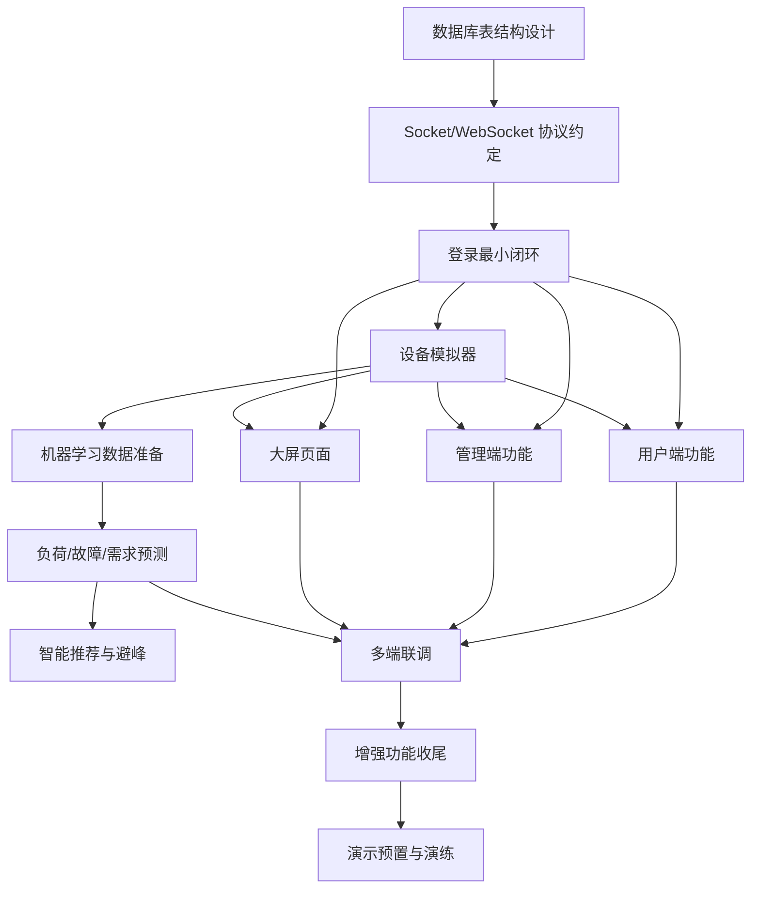

# 01 · 路线图

回答三个问题：先做什么、后做什么、哪些能并行、哪些互相依赖。以"阶段"而非硬日期组织，可整体平移；分工按模块给出，可随人数增减合并。详细可勾选任务清单见 `tasks.md`。

## 读图约定

- 责任缩写：DB（数据库）、NET（通信框架）、SIM（设备模拟器）、USER（用户端）、ADMIN（管理端）、SCREEN（大屏）、ML（机器学习）、ALL（全员）。
- `【基础】`为必做项，`【增强】`为可加分项。
- "冻结"指 schema 或协议定稿后不再随意改动，改动需全组同步。

## 依赖关系总览

一条不可跳过的地基链：**数据库表结构 → 通信协议 → 登录最小闭环 → 各端功能 → 联调 → 演示**。地基之上，用户端、管理端、大屏、设备模拟器四个方向完全并行。

要点：虚线以上是串行段；从设备模拟器往下是并行主战场。机器学习从设备模拟器旁支出，与各端功能开发时间重叠。

## 阶段划分与里程碑

| 阶段 | 内容 | 是否阻塞后续 | 里程碑 |
| ---- | ---- | ------------ | ------ |
| 阶段 0 | 需求与设计对齐（DB、协议、规范、分工） | 是，全项目地基 | schema v1、协议 v1 冻结 |
| 阶段 1 | 地基开发（建库建表、通信框架、登录最小闭环） | 是 | M1 登录数据多端串通 |
| 阶段 2 | 各端功能开发（用户端/管理端/大屏/设备模拟器） | 部分 | M2 各端核心功能可独立演示 |
| 阶段 3 | 机器学习（与时序数据准备并行） | 部分 | M3 负荷预测接入展示 |
| 阶段 4 | 多端联调 | 是 | M4 故障恢复链路走通 |
| 阶段 5 | 增强功能收尾（可裁减，从 `spec-增强功能池` 挑选提升项） | 否 | — |
| 阶段 6 | 演示预置与交付 | 是 | M5 演示剧本完整走一遍 |

## 关键路径

决定总工期的是最长串行链，共五环：

**数据库设计 → 通信协议 → 设备模拟器 → 负荷预测 → 故障恢复链路联调 → 演示预置**

其余功能多挂在并行分支上。抢工期的策略：尽早冻结 schema 与协议、尽早让设备模拟器出数据。

## 并行与串行清单

- **可并行**：schema、协议冻结后，用户端、管理端、大屏、设备模拟器、机器学习数据准备五方向互不等待；大屏 UI 可用假数据先行；ML 训练可与功能开发并行。
- **必须串行**：数据库设计先于一切；协议约定先于一切联网功能；设备模拟器先于用户端充电、管理端监控、大屏实时、机器学习数据；联调等各端主体完成；演示预置等联调走通。

## 风险与缓解

| 风险 | 后果 | 缓解办法 |
| ---- | ---- | -------- |
| 表结构/协议中途返工 | 各端大面积重写 | 阶段 0 冻结，改动走全组评审 |
| 联调时枚举值不一致 | 数据对不上 | 维护共享枚举字典（spec-数据库），各端引用 |
| 机器学习无训练数据 | 负荷预测做不出来 | 设备模拟器尽早产出数据，必要时规则生成历史数据 |
| 增强功能贪多 | 基础闭环不稳 | 先保基础闭环；想法统一收进 `spec-增强功能池`，增强项按优先级与"一功能服务多模块"原则裁剪 |
| 大屏等后端空转 | 浪费工时 | 大屏先用假数据搭页面，联调再换数据源 |
