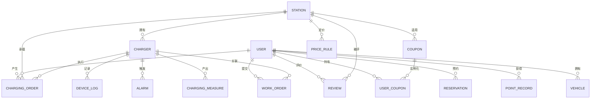

# spec-数据库（冻结真相源）

本文件是全仓库表结构、字段、枚举的唯一权威。任何端需要字段名、类型、枚举值时从这里取值，禁止各自硬编码。改动本文件属于"解冻"，须先改这里再通知全组同步（见 `AGENTS.md`）。

## 总体约定

- 数据库采用 QSQLite 单文件部署，所有业务数据由服务端统一读写，用户端与 Web 大屏经服务端 WebSocket 间接访问，不直连数据库文件。
- 表名、字段名使用英文小写蛇形命名。
- 主键统一为自增整数 `id`；外键以 `xxx_id` 命名并指向对应表主键。
- 字段类型沿用 SQLite 三类：INTEGER、REAL、TEXT（日期时间与 JSON 文本均存 TEXT）。
- 时间统一格式：`YYYY-MM-DD HH:MM:SS`。

## 实体关系

文字关系：

- 一座充电站拥有多台充电桩，一台充电桩只属于一座充电站。
- 一个用户产生多笔充电订单、多条预约记录、多条积分记录、多辆车、多条评价、多张持有券、多条工单。
- 一笔充电订单关联一个用户、一座充电站、一台充电桩。
- 一台充电桩产生多条设备操作日志、多条告警、多条时序测量记录、多条关联工单。
- 一座充电站对应一套（或多档）分时电价规则，可被多条评价与多张指定站券关联。
- 一个券模板（coupon）实例化为多个用户持有券（user_coupon）。

## 核心表

### user（用户）

| 字段 | 类型 | 说明 |
| ---- | ---- | ---- |
| id | INTEGER | 主键，自增 |
| phone | TEXT | 手机号，11 位，唯一 |
| nickname | TEXT | 昵称，默认"用户+后四位" |
| avatar_path | TEXT | 头像文件路径，默认空（灰色占位图） |
| balance | REAL | 钱包余额（元） |
| register_time | TEXT | 注册时间（首次登录自动创建） |
| status | TEXT | 状态：normal / frozen |
| level | TEXT | 会员等级：normal / vip / enterprise |
| points | INTEGER | 累计可用积分 |

### admin（管理员）

| 字段 | 类型 | 说明 |
| ---- | ---- | ---- |
| id | INTEGER | 主键，自增 |
| account | TEXT | 管理员账号，唯一 |
| password | TEXT | 登录密码 |

默认初始记录：`admin / 123456`。

### station（充电站）

| 字段 | 类型 | 说明 |
| ---- | ---- | ---- |
| id | INTEGER | 主键，自增（即充电站 ID） |
| name | TEXT | 站名 |
| address | TEXT | 详细地址 |
| longitude | REAL | 经度（腾讯地图地理编码结果） |
| latitude | REAL | 纬度 |
| total_chargers | INTEGER | 总电桩数 |
| online_rate | REAL | 当前在线率，动态计算 |

### charger（充电桩）

| 字段 | 类型 | 说明 |
| ---- | ---- | ---- |
| id | INTEGER | 主键，自增 |
| code | TEXT | 电桩编号（如 A-023），站内唯一 |
| station_id | INTEGER | 外键，所属充电站 |
| type | TEXT | 类型：fast / slow |
| power | REAL | 额定功率（kW） |
| status | TEXT | 状态：idle / charging / reserved / fault / offline / rebooting |
| total_charge_count | INTEGER | 累计充电次数 |
| total_charge_duration | INTEGER | 累计充电时长（分钟） |
| health_score | INTEGER | 设备健康度（0–100） |
| temperature | REAL | 当前温度 |
| comm_status | TEXT | 通信状态：normal / abnormal |

### charging_order（充电订单）

记录"预约—充电—计费—结算"全流程，各端状态机统一引用本表 `status`。

| 字段 | 类型 | 说明 |
| ---- | ---- | ---- |
| id | INTEGER | 主键，自增 |
| user_id | INTEGER | 外键，下单用户 |
| station_id | INTEGER | 外键，目标充电站 |
| charger_id | INTEGER | 外键，充电电桩 |
| status | TEXT | reserved / charging / pending_settle / completed / cancelled |
| start_time | TEXT | 开始充电时间 |
| end_time | TEXT | 结束充电时间 |
| duration_min | INTEGER | 充电时长（分钟） |
| energy_kwh | REAL | 充电量（kWh） |
| price_level | TEXT | 结算电价档位：valley / flat / peak |
| amount | REAL | 结算费用（元） |
| points_earned | INTEGER | 本单获得积分 |
| create_time | TEXT | 订单创建时间 |

### reservation（预约）

支撑智能排队。

| 字段 | 类型 | 说明 |
| ---- | ---- | ---- |
| id | INTEGER | 主键，自增 |
| user_id | INTEGER | 外键，预约用户 |
| station_id | INTEGER | 外键，目标电站 |
| queue_no | INTEGER | 排队序号 |
| reserve_time | TEXT | 进入排队时间 |
| estimate_start_time | TEXT | 预计开始充电时间 |
| status | TEXT | waiting / matched / cancelled |

## 增强表

### device_log（设备操作日志）

| 字段 | 类型 | 说明 |
| ---- | ---- | ---- |
| id | INTEGER | 主键，自增 |
| charger_id | INTEGER | 外键，目标电桩 |
| action | TEXT | restart / pause / repair |
| operator | TEXT | 操作管理员账号 |
| op_time | TEXT | 操作时间 |
| result | TEXT | success / failed |

### alarm（告警）

| 字段 | 类型 | 说明 |
| ---- | ---- | ---- |
| id | INTEGER | 主键，自增 |
| charger_id | INTEGER | 外键，告警电桩（可为空，表示站点级告警） |
| station_id | INTEGER | 外键，告警电站 |
| type | TEXT | comm_abnormal / overheat / power_drop / offline / user_behavior |
| level | TEXT | info / warning / critical |
| occur_time | TEXT | 告警发生时间 |
| status | TEXT | open / handled |
| handle_action | TEXT | restart / pause / repair / ignore |

### price_rule（分时电价）

| 字段 | 类型 | 说明 |
| ---- | ---- | ---- |
| id | INTEGER | 主键，自增 |
| station_id | INTEGER | 外键，适用电站（可全局共用一行） |
| level | TEXT | valley / flat / peak |
| price | REAL | 单价（元/kWh） |
| time_range | TEXT | 对应时段范围，如 "00:00–08:00" |

### point_record（积分记录）

| 字段 | 类型 | 说明 |
| ---- | ---- | ---- |
| id | INTEGER | 主键，自增 |
| user_id | INTEGER | 外键，用户 |
| change | INTEGER | 积分变动（正为获得，负为抵扣） |
| reason | TEXT | charge / redeem |
| create_time | TEXT | 变动时间 |

### charging_measure（充电时序测量）

逐桩记录充电过程负荷与时序数据，是机器学习预测与健康度评估的数据源。

| 字段 | 类型 | 说明 |
| ---- | ---- | ---- |
| id | INTEGER | 主键，自增 |
| charger_id | INTEGER | 外键，测量电桩 |
| station_id | INTEGER | 外键，所属电站 |
| measure_time | TEXT | 采样时间 |
| power_kw | REAL | 瞬时功率 |
| soc | REAL | 该桩当前 SOC |
| energy_delta_kwh | REAL | 本采样间隔充电量 |

### vehicle（我的车辆）

用户可添加多辆车，支撑车型兼容过滤与所需电量估算。

| 字段 | 类型 | 说明 |
| ---- | ---- | ---- |
| id | INTEGER | 主键，自增 |
| user_id | INTEGER | 外键，车主 |
| name | TEXT | 车辆名称（如"我的小鹏"） |
| type | TEXT | 车型：car / light_truck / two_wheeler / three_wheeler |
| battery_kwh | REAL | 电池容量（kWh） |
| connector_type | TEXT | 接口类型：ac_gb / dc_gb / other |
| max_power_kw | REAL | 最大支持功率（kW） |
| created_time | TEXT | 添加时间 |

### review（站点评价）

多维评分 + 标签 + 有用机制，供大屏/管理端反馈分析。

| 字段 | 类型 | 说明 |
| ---- | ---- | ---- |
| id | INTEGER | 主键，自增 |
| user_id | INTEGER | 外键，评价用户 |
| station_id | INTEGER | 外键，被评电站 |
| order_id | INTEGER | 外键，关联订单（可空） |
| overall_score | REAL | 综合评分（0–5） |
| speed_score | REAL | 充电速度分 |
| device_score | REAL | 设备状况分 |
| parking_score | REAL | 停车便利分 |
| hygiene_score | REAL | 卫生环境分 |
| service_score | REAL | 服务态度分 |
| tags | TEXT | 标签列表（JSON 数组，取值见枚举） |
| content | TEXT | 文字评价 |
| useful_count | INTEGER | 被点"有用"次数 |
| status | TEXT | 状态：normal / hidden |
| create_time | TEXT | 评价时间 |

### work_order（工单）

统一承载用户投诉、设备故障、退款、设备维护、异常订单等事件。

| 字段 | 类型 | 说明 |
| ---- | ---- | ---- |
| id | INTEGER | 主键，自增 |
| type | TEXT | 类型：user_complaint / device_fault / refund / maintenance / abnormal_order |
| priority | TEXT | 优先级：low / medium / high |
| user_id | INTEGER | 外键，提交用户（设备/系统类可空） |
| station_id | INTEGER | 外键，关联电站（可空） |
| charger_id | INTEGER | 外键，关联电桩（可空） |
| title | TEXT | 标题 |
| description | TEXT | 描述 |
| status | TEXT | 状态：pending / processing / completed / closed |
| handler | TEXT | 处理管理员账号 |
| result | TEXT | 处理结果/备注 |
| create_time | TEXT | 创建时间 |
| handle_time | TEXT | 处理完成时间 |

### coupon（优惠券模板）

由管理端营销中心配置，可被多个用户领取后实例化为 user_coupon。

| 字段 | 类型 | 说明 |
| ---- | ---- | ---- |
| id | INTEGER | 主键，自增 |
| title | TEXT | 券名（如"新人立减 ¥5"） |
| type | TEXT | 类型：new_user / full_reduction / night / site |
| discount_amount | REAL | 抵扣金额（元） |
| min_amount | REAL | 满减门槛（元，0 表示无门槛） |
| station_id | INTEGER | 适用电站（空为通用） |
| valid_days | INTEGER | 领取后有效天数 |
| total | INTEGER | 发放总数（-1 不限） |
| status | TEXT | 状态：active / inactive |

### user_coupon（用户持有券）

| 字段 | 类型 | 说明 |
| ---- | ---- | ---- |
| id | INTEGER | 主键，自增 |
| user_id | INTEGER | 外键，持券用户 |
| coupon_id | INTEGER | 外键，券模板 |
| status | TEXT | 状态：unused / used / expired |
| receive_time | TEXT | 领取时间 |
| used_order_id | INTEGER | 核销订单（可空） |

## 枚举与一致性约定

跨表复用的枚举统一取值，各端引用本表而非各自硬编码：

| 枚举 | 取值 |
| ---- | ---- |
| 用户状态 | normal / frozen |
| 会员等级 | normal / vip / enterprise |
| 订单状态 | reserved / charging / pending_settle / completed / cancelled |
| 电桩状态 | idle / charging / reserved / fault / offline / rebooting |
| 电桩类型 | fast / slow |
| 电价档位 | valley / flat / peak |
| 告警级别 | info / warning / critical |
| 告警类型 | comm_abnormal / overheat / power_drop / offline / user_behavior |
| 设备操作 | restart / pause / repair |
| 车型类型 | car / light_truck / two_wheeler / three_wheeler |
| 接口类型 | ac_gb / dc_gb / other |
| 评价标签 | fast_charge / spacious / quiet_night / high_parking_fee / old_device / good_fast_charge / heavy_queue / good_service（可扩展为自由文本） |
| 评价状态 | normal / hidden |
| 工单类型 | user_complaint / device_fault / refund / maintenance / abnormal_order |
| 工单优先级 | low / medium / high |
| 工单状态 | pending / processing / completed / closed |
| 券类型 | new_user / full_reduction / night / site |
| 券模板状态 | active / inactive |
| 券状态 | unused / used / expired |

## 数据读写边界

| 数据 | 负责写入的一端 | 读用方 |
| ---- | -------------- | ------ |
| 用户、余额、积分 | 用户端（登录/注册/充值/结算） | 管理端、服务端 |
| 订单、预约 | 用户端（下单/充电/结算）、服务端定时任务 | 管理端、大屏 |
| 电桩实时状态、测量数据 | 服务端设备模拟/采集线程 | 用户端、大屏、机器学习 |
| 电桩/电站/电价/管理员 | 管理端（新增/维护） | 用户端、大屏 |
| 告警、设备日志 | 服务端故障监测、管理端运维 | 大屏、AI 助手 |
| 车辆 | 用户端（添加/修改） | 服务端（兼容过滤）、管理端 |
| 评价 | 用户端（提交/点有用） | 大屏、管理端、机器学习 |
| 工单 | 用户端（提交）、管理端（处理）、服务端（设备类自动建） | 用户端、管理端、大屏 |
| 券模板 | 管理端（营销中心配置） | 用户端、服务端 |
| 用户持有券 | 用户端（领券/结算核销） | 管理端（营销统计） |

## 种子数据约定

建库脚本随服务端一起执行，保证演示环境一致。至少包含：

- 管理员：`admin / 123456`。
- 充电站：3–5 座，覆盖不同区域，每站含地址与经纬度。
- 充电桩：每站 6–20 台，快慢充混合，初始状态按需分布（含若干故障桩用于演示）。
- 分时电价：至少一套谷/平/峰三档规则。
- 用户：2–3 个测试手机号（如 `13800000001`），含一定余额与历史订单（供画像、营收、负荷预测演示）。

## 待定项清单

| 项 | 位置 | 说明 |
| --- | ---- | ---- |
| 种子数据具体规模与示例桩号 | 本文件「种子数据约定」 | 由 DB 负责人实现时确定，建议初值：3 站、每站 10 桩、含 2 台故障桩 |
| `online_rate` 计算口径 | station 表 | 建议初值：在线桩数 / 总桩数 × 100% |
