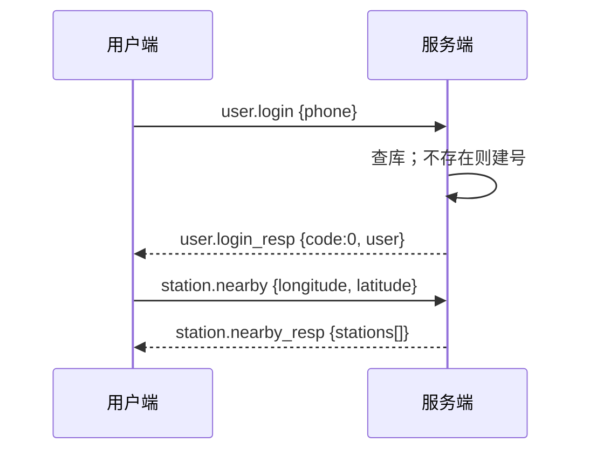
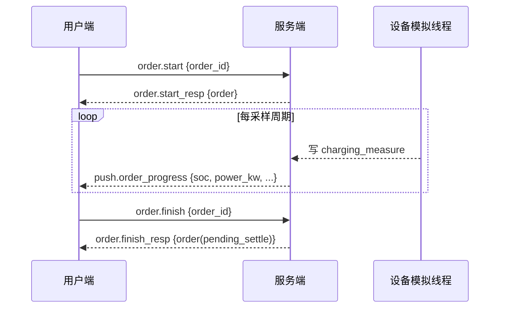
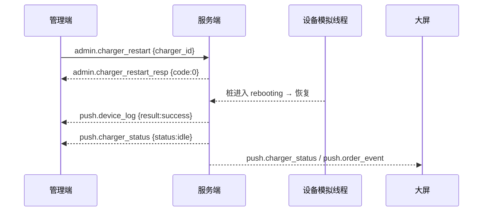

# spec-协议（冻结真相源）

！！！后续可以添加更改！！！

本文件是全仓库 WebSocket 消息协议的唯一定义。任何端新增或改动消息，必须先改本文件再同步实现（见 `AGENTS.md`）。协议版本 v1。

**!!!不代表终版，只是参考!!!**

## 传输层约定

- 协议：WebSocket（服务端用 `QWebSocketServer`，Qt 端用 `QWebSocket`，大屏用浏览器原生 WebSocket）。
- 载荷格式：JSON，UTF-8 编码。
- 服务端监听地址/端口：`ws://127.0.0.1:9000`（端口 `[待定]`，建议初值 9000）。
- 连接方式：用户端/管理端/大屏各建一条 WebSocket 连接，共用同一协议；大屏只读订阅推送，不发送写操作。
- 心跳：客户端每 15 秒发送 `system.ping`（`[待定]`，建议初值 15s），服务端回 `system.pong`；服务端连续 3 次未收到 ping 则断开该连接。

## 消息信封

请求（客户端 → 服务端）：

```json
{ "type": "user.login", "seq": 1, "payload": { "phone": "13812348241" } }
```

响应（服务端 → 客户端，`seq` 回填请求的 `seq`）：

```json
{ "type": "user.login_resp", "seq": 1, "code": 0, "message": "ok", "payload": { "user": { "id": 3, "phone": "13812348241", "nickname": "用户8241", "balance": 50.0 } } }
```

服务端主动推送（无 `seq`）：

```json
{ "type": "push.charger_status", "payload": { "charger_id": 7, "status": "charging", "soc": 42.5 } }
```

字段约定：`type` 为消息类型（下文字典）；`seq` 为请求序号（客户端自增，推送可省略）；`code` 为错误码（0 成功，非 0 见错误码表）；`message` 为可读说明；`payload` 为业务数据对象。

## 消息类型字典

### 用户端

| type | 方向 | 说明 | payload 要点 |
| ---- | ---- | ---- | ------------ |
| `user.login` | C→S | 手机号免密登录（不存在则自动注册） | phone |
| `user.login_resp` | S→C | 登录结果 | user 对象 |
| `user.info` | C→S | 获取当前用户信息 | 身份取自 WebSocket 连接，不传 user_id |
| `user.info_resp` | S→C | 用户信息 + 充电画像 | user, portrait |
| `user.recharge` | C→S | 余额充值（模拟支付） | amount |
| `user.recharge_resp` | S→C | 充值结果 | balance |
| `user.update_profile` | C→S | 修改昵称/头像 | nickname?, avatar_path? |
| `user.update_profile_resp` | S→C | 修改结果 | user |
| `station.nearby` | C→S | 附近充电站列表 | longitude, latitude |
| `station.nearby_resp` | S→C | 按距离排序的电站列表 | stations[]（含 distance） |
| `station.detail` | C→S | 电站电桩明细 | station_id |
| `station.detail_resp` | S→C | 电站 + 电桩数组 | station, chargers[] |
| `station.recommend` | C→S | 智能推荐/一键找桩 | constraints{}（可空） |
| `station.recommend_resp` | S→C | 推荐结果 | recommendation |
| `reservation.join` | C→S | 加入智能排队 | user_id, station_id |
| `reservation.join_resp` | S→C | 排队结果 | reservation, queue |
| `reservation.cancel` | C→S | 取消预约 | reservation_id |
| `reservation.cancel_resp` | S→C | 取消结果 | — |
| `order.create` | C→S | 预约/创建订单 | user_id, station_id, charger_id |
| `order.create_resp` | S→C | 创建结果 | order |
| `order.start` | C→S | 开始充电 | order_id |
| `order.start_resp` | S→C | 开始结果 | order |
| `order.finish` | C→S | 结束充电 | order_id |
| `order.finish_resp` | S→C | 结束结果（转待结算） | order |
| `order.settle` | C→S | 结算（扣余额、发积分） | order_id |
| `order.settle_resp` | S→C | 结算结果 | order, points |
| `order.cancel` | C→S | 取消订单 | order_id |
| `order.list` | C→S | 我的订单 | user_id, status? |
| `order.list_resp` | S→C | 订单列表 | orders[] |
| `order.detail` | C→S | 订单详情（含时间轴） | order_id |
| `order.detail_resp` | S→C | 订单 + 时间轴 | order, timeline[] |

### 管理端

| type | 方向 | 说明 | payload 要点 |
| ---- | ---- | ---- | ------------ |
| `admin.login` | C→S | 管理员登录 | account, password |
| `admin.login_resp` | S→C | 登录结果 | admin |
| `admin.revenue` | C→S | 销售业绩（7/30 日） | days |
| `admin.revenue_resp` | S→C | 营收趋势 + 指标 | trend[], today, month, total |
| `admin.station_status` | C→S | 电桩状态分布 | — |
| `admin.station_status_resp` | S→C | 在用/闲置/故障分布 | distribution |
| `admin.station_list` | C→S | 电站列表 | — |
| `admin.station_list_resp` | S→C | stations[] | — |
| `admin.station_detail` | C→S | 电站详情（含数字孪生数据） | station_id |
| `admin.station_detail_resp` | S→C | station, chargers[] | — |
| `admin.station_add` | C→S | 新增电站 | station 字段 |
| `admin.station_add_resp` | S→C | 新增结果 | station |
| `admin.charger_list` | C→S | 电桩列表 | station_id? |
| `admin.charger_list_resp` | S→C | chargers[] | — |
| `admin.charger_restart` | C→S | 远程重启 | charger_id |
| `admin.charger_restart_resp` | S→C | 指令接收结果 | charger_id |
| `admin.charger_pause` | C→S | 暂停使用 | charger_id |
| `admin.charger_pause_resp` | S→C | 暂停结果 | charger_id |
| `admin.user_list` | C→S | 用户列表（可模糊搜索） | keyword? |
| `admin.user_list_resp` | S→C | users[] | — |
| `admin.user_toggle_status` | C→S | 冻结/解冻 | user_id, status |
| `admin.user_toggle_status_resp` | S→C | 结果 | user |
| `admin.device_log` | C→S | 某桩操作日志 | charger_id |
| `admin.device_log_resp` | S→C | logs[] | — |
| `admin.fault_risk` | C→S | 故障风险排序 | — |
| `admin.fault_risk_resp` | S→C | risks[] | — |
| `admin.whatif` | C→S | what-if 仿真 | scenario{} |
| `admin.whatif_resp` | S→C | 指标影响推演 | impact |
| `admin.assistant_query` | C→S | AI 运营助手提问 | question |
| `admin.assistant_query_resp` | S→C | 回答 | answer |

### 服务端推送（订阅广播）

| type | 方向 | 说明 | payload 要点 |
| ---- | ---- | ---- | ------------ |
| `push.charger_status` | S→各端 | 电桩状态/参数变化 | charger_id, status, soc, power_kw, temperature |
| `push.order_progress` | S→用户端 | 充电过程实时进度 | order_id, soc, power_kw, energy, cost, eta |
| `push.alarm` | S→管理端/大屏 | 新告警 | alarm |
| `push.device_log` | S→管理端 | 运维动作结果 | device_log |
| `push.order_event` | S→大屏 | 订单/充电事件流 | event（开始/完成/结算等） |
| `push.reservation_notify` | S→用户端 | 排队轮到自己 | reservation_id, charger_id |

### 系统与机器学习

| type | 方向 | 说明 | payload 要点 |
| ---- | ---- | ---- | ------------ |
| `system.ping` / `system.pong` | 双向 | 心跳 | timestamp |
| `ml.forecast` | 各端→S | 负荷预测查询 | station_id?, horizon |
| `ml.forecast_resp` | S→C | 预测序列 | forecast[]（实际+预测） |
| `push.forecast` | S→大屏/用户端 | 预测更新推送 | station_id, horizon, series |
| `screen.snapshot` | 大屏→S | 拉取全量快照 | — |
| `screen.snapshot_resp` | S→C | 驾驶舱全量数据 | 见 spec-大屏 |

### 增强消息（可选实现）

随 `spec-增强功能池` 提升的功能配套，实现与否由各端按裁剪决定；实现前先在本文档补全 payload 字段。

用户端：

| type | 方向 | 说明 | payload 要点 |
| ---- | ---- | ---- | ------------ |
| `vehicle.add` | C→S | 添加我的车辆 | name, type, battery_kwh, connector_type, max_power_kw |
| `vehicle.add_resp` | S→C | 添加结果 | vehicle |
| `vehicle.list` | C→S | 我的车辆列表 | — |
| `vehicle.list_resp` | S→C | 车辆列表 | vehicles[] |
| `vehicle.update` | C→S | 修改车辆 | vehicle_id, 变更字段 |
| `vehicle.update_resp` | S→C | 修改结果 | vehicle |
| `review.create` | C→S | 提交站点评价 | order_id, overall_score, speed_score, device_score, parking_score, hygiene_score, service_score, tags[], content |
| `review.create_resp` | S→C | 提交结果 | review |
| `review.list` | C→S | 站点评价列表 | station_id |
| `review.list_resp` | S→C | 评价列表 | reviews[] |
| `review.useful` | C→S | 点"有用" | review_id |
| `review.useful_resp` | S→C | 结果 | useful_count |
| `work_order.create` | C→S | 提交工单 | type, station_id?, charger_id?, title, description |
| `work_order.create_resp` | S→C | 提交结果 | work_order |
| `work_order.list` | C→S | 我的工单 | — |
| `work_order.list_resp` | S→C | 工单列表 | work_orders[] |
| `coupon.list` | C→S | 我的优惠券 | status? |
| `coupon.list_resp` | S→C | 券列表 | coupons[] |
| `coupon.claim` | C→S | 领取优惠券 | coupon_id |
| `coupon.claim_resp` | S→C | 领取结果 | user_coupon |

管理端：

| type | 方向 | 说明 | payload 要点 |
| ---- | ---- | ---- | ------------ |
| `admin.cockpit` | C→S | 今日运营总览 | — |
| `admin.cockpit_resp` | S→C | 指标卡 + 趋势 | today_revenue, today_orders, energy_kwh, online_rate, avg_utilization, user_growth, trends[] |
| `admin.station_analysis` | C→S | 站点运营分析 | station_id |
| `admin.station_analysis_resp` | S→C | 单站指标 + 高峰时段 | utilization, daily_orders, daily_revenue, fault_rate, avg_wait, score, peak_hours[] |
| `admin.alarm_list` | C→S | 告警列表 | status? |
| `admin.alarm_list_resp` | S→C | alarms[] | — |
| `admin.alarm_handle` | C→S | 处理告警 | alarm_id, action |
| `admin.alarm_handle_resp` | S→C | 处理结果 | alarm |
| `admin.work_order_list` | C→S | 工单列表 | status? |
| `admin.work_order_list_resp` | S→C | work_orders[] | — |
| `admin.work_order_handle` | C→S | 处理工单 | work_order_id, status, result |
| `admin.work_order_handle_resp` | S→C | 处理结果 | work_order |
| `admin.marketing_list` | C→S | 券模板 + 活动统计 | — |
| `admin.marketing_list_resp` | S→C | coupons[], stats | — |
| `admin.coupon_create` | C→S | 新建券模板 | title, type, discount_amount, min_amount, station_id?, valid_days, total |
| `admin.coupon_create_resp` | S→C | 创建结果 | coupon |
| `admin.user_portrait` | C→S | 用户画像 | user_id |
| `admin.user_portrait_resp` | S→C | 画像字段 | portrait |

服务端推送：

| type | 方向 | 说明 | payload 要点 |
| ---- | ---- | ---- | ------------ |
| `push.work_order` | S→管理端 | 新工单实时推送 | work_order |
| `push.review` | S→大屏/管理端 | 新评价实时推送 | review |

> 注：`order.settle` 可携带 `coupon_id` 完成券核销抵扣；抵扣时订单实付金额 = 应收 − 券面额。

## 错误码

| code | 含义 |
| ---- | ---- |
| 0 | 成功 |
| 1001 | 账号或密码错误 |
| 1002 | 手机号格式错误 |
| 1003 | 用户已被冻结 |
| 1004 | 未登录 |
| 2001 | 存在未完成的充电订单 |
| 2002 | 余额不足 |
| 2003 | 订单状态不允许该操作 |
| 3001 | 设备离线或不可用 |
| 3002 | 电桩非空闲 |
| 3003 | 远程重启失败 |
| 4001 | 数据不存在 |
| 4002 | 数据冲突（如重复手机号） |
| 5001 | 预测/模型不可用（触发兜底） |
| 9001 | 消息格式错误 |
| 9002 | 未知消息类型 |

## 时序示例

### 免密登录 + 附近电站



### 充电进度推送



### 远程重启（管理端 → 模拟 → 广播）



## 待定项清单

| 项 | 说明 |
| --- | ---- |
| 服务端端口 | 建议初值 9000 |
| 心跳间隔 / 超时次数 | 建议初值 15s / 3 次 |
| 大屏鉴权方式 | 建议初值：大屏免登录只读连接 |
| `station.recommend` 约束字段全集 | 见 spec-用户端「智能推荐」，字段由实现定稿后回填本表 |
